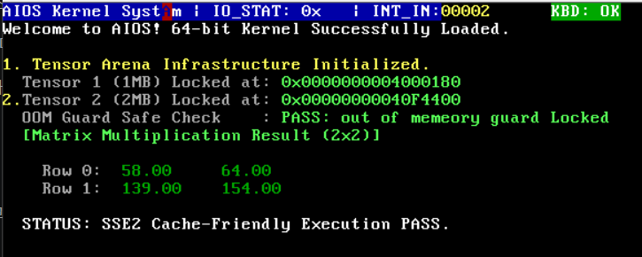

# Cache Friendly Matrix Engine

## 1. Overview

현재 AIOS는 행 우선 연속 정렬 구조의 2차원 행렬 가상 장치와 캐시 최적화 곱셈 엔진을 구현합니다. 

이는 tensor arena 물리 메모리 위에서 대규모 부동소수점 연산을 초고속으로 처리하기 위한 것입니다. 

단순히 소프트웨어적인 구현을 넘어서 x86_64 베어메탈 커널 환경의 하드웨어 제어 레지스터를 직접 조작합니다. 

이를 통해 cpu 내장 가속 장치(sse2)를 깨우고 연산 파이프라인을 구축할 수 있었습니다. 

현재 구현한 함수는 아래와 같습니다. 

- matrix create: tensor arena 끝 분할 선점 기반으로 2차원 행렬을 생성합니다. 
- matrix_set & matrix_get: 행 우선 1차원 선형 매핑 및 데이터 입출력
- matrix_mul: cpu L1 캐시 적중률 최적화형 루프 행렬 곱셈
- vga_write_float: 가변 자릿수를 동적으로 계산하여 VGA에 보여주는 실수형 포맷터

## 2. CPU 제어 레지스터(CR0/CR4) 잠금 해제

x86)64 아키텍처 커널 초기화 단계에서는 하드웨어 보호를 위해서 부동 소수점 및 벡터 연산이 잠겨있습니다. 

이를 풀지 않고 float 연산을 수행하면 부팅 중 문제가 발생할 수 있습니다. 

따라서 boot.S에서 제어 레지스터 스위치를 조작하여 잠금을 해제해줍니다. 

- cr0, cr4, fninit

## 3. 런타임 검증

kernel.c에서 matrix engine의 정상 가동 여부를 확인하기 위해서 다음과 같은 행렬 연산을 진행했습니다. 

      행렬 A (2 x 3)     행렬 B (3 x 2)      행렬 C (2 x 2)

    ┌ 1.0  2.0  3.0 ┐   ┌ 7.0   8.0  ┐    ┌ 58.00   64.00  ┐
    └ 4.0  5.0  6.0 │   │ 9.0   10.0 │    └ 139.00  154.00 ┘
                        └ 11.0  12.0 ┘

